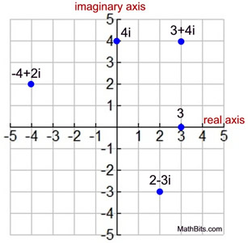

This is a complex number: $$z = x + iy$$
A complex number, as a combination of a real number (<code>$x$</code>) and an imagenary number (<code>$iy$</code>, or <code>$yi$</code>, it doesn't matter) can be sketched with 2-dimentional axis. Note that <code>$y$</code> is a real number, and <code>$i$</code> is an imagenary number (<code>$i = \sqrt{-1}$</code>).

This is an example from [mathbits](https://mathbitsnotebook.com/Algebra2/ComplexNumbers/CPGraphs.html):

The real axis represents the real number <code>$x$</code>, with each unit representing 1. The imagenary axis represents the imagenary part <code>$iy$</code>, each unit representing <code>$i$</code>, and <code>$y$</code> represents the number of units.

Also, to represent an complex number with number pairs, we can use the format of <code>$(x, y)$</code>. For example, <code>$i=2+3i$</code> can be noted down as <code>$(2,3)$</code>.

If you have learned Calc 2, you may have heard about polar coordinates. We can also use polar system to sketch complex numbers. 

For example, <code>$z=x+iy$</code> can be represented as:
 $$z= r(\cos{\theta}+i\sin{\theta})$$
Here is an image copied from [Online Math Learning Website](https://www.onlinemathlearning.com/complex-plane-hsn-cn4.html):

To use pairs, we can note down in <code>$(r, \theta)$</code> form. For example, <code>$z=1+i$</code> can be represented as <code>$(\sqrt{2}, \frac{\pi}{4})$</code> (45 degree angle), or to be more cautious let's write down <code>$(\sqrt{2},\frac{\pi}{4}+2k\pi)$</code>, if you rotate extra <code>$360\degree, 720 \degree$</code>, etc. You are back to where 45 degree line locates.

If you have learned Calc 2, you may also have heard of Taylor Series. You can use Taylor Series to get a wierd form:
$$\cos{\theta}+i\sin{\theta}=e^{i\theta}$$

Here is the proof from YouTube: <iframe width="560" height="315" src="https://www.youtube.com/embed/GqvDUcU8F3I?si=VGYh7lccROpKH5nW" title="YouTube video player" frameborder="0" allow="accelerometer; autoplay; clipboard-write; encrypted-media; gyroscope; picture-in-picture; web-share" allowfullscreen></iframe>

Then, the complex number <code>$z=x+iy$</code> can be represented as:
 $$z=re^{i\theta}$$

When you have the <code>$e$</code> form of the complex number, if you would like to calculate the root or power of it, it's becoming simpler.

(To be continued...)