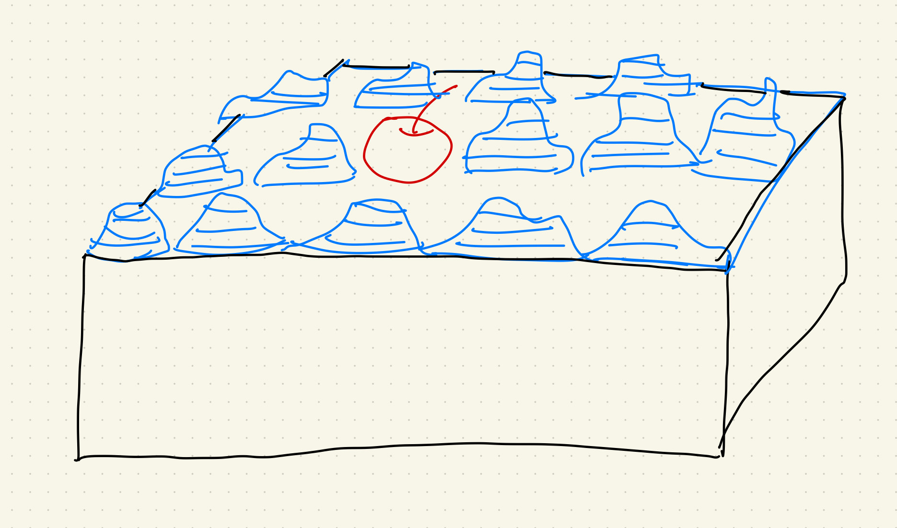
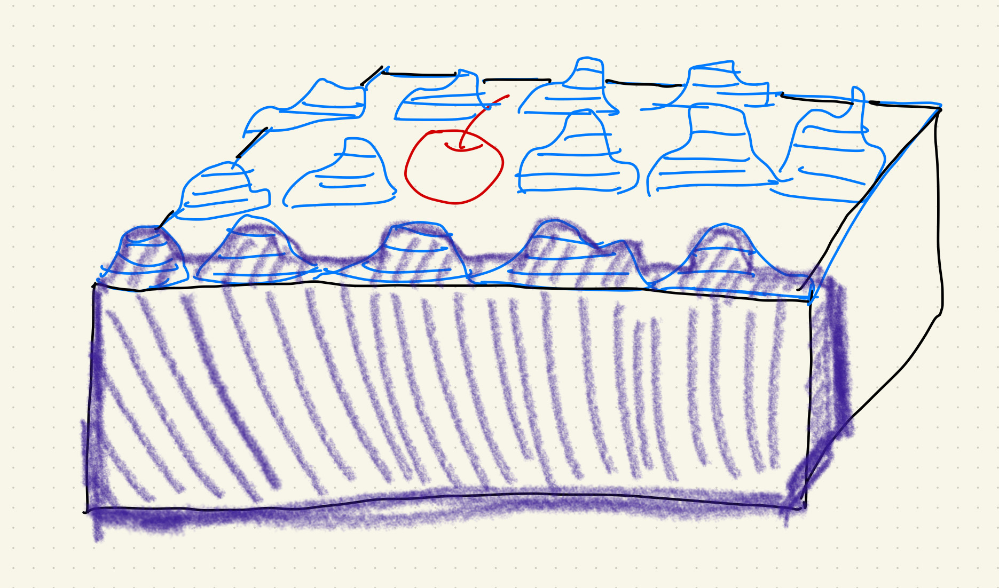
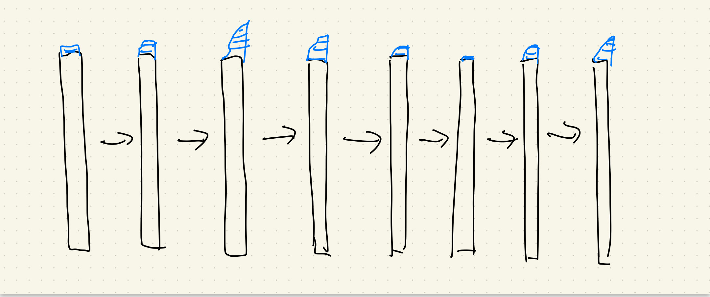

As a person who've only completed Calc 1 & 2, I just started learning some partial differentiation. The symbol of partial differentiaion is a bit confused to me at first, but there's an easier way of thinking about differentiaion in 3-dimentional cases: cutting cakes.

When you plan to cut a cake, you can either cut it in two ways: you can cut it from left to right, or from front to back.

